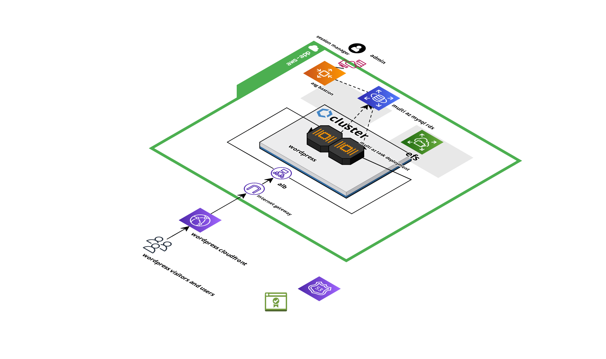

# AWS ECS APP

This repo contain full Terraform code, configuration files and documentation needed to deploy and maintain a WordPress site on AWS. 

## Screenshots

Here's a screenshot of the project:



## Guide

The IaC has been developed with Terraform. 

The IaC has been developed with Terraform. The architecture was designed to be deployed on different environments (dev and prod) with different configurations. The 'develop' branch differs from its production counterpart in a few aspects: it lacks validated domain solutions such as ACM certificates, public Route 53 hosted zones, etc. A mock infrastructure was set up to test core functionalities. The 'prod' environment is intended to be the ready-to-go solution from scratch.

Repo is organized as:

```
root
├── LICENSE
├── README.md
└── terraform
        ├── ecs    - wordpress app based on a ecs fargate cluster solution
        ├── rds    - database and bastion
        │   
        ├── frontend - alb, route53 records, acm...
        │   
        └── network    - networking and route53 configuration
```  

Each module has it own order of deploy 'cause of obvious dependencies. To deploy correctly the order is:
```
├── network
       ├──rds
       ├──frontend
             ├──ecs
```              

## Architecture

### Network:
During the VPC creation, public and private subnets are generated across different availability zones using values set up in local variables and the VPC module. For the production environment, single_nat_gateway is set to false to create a NAT gateway for each AZ (one per NAT subnet), while for development environments, a single NAT gateway is deployed to reduce costs. A Route 53 zone (type "private" for dev env and "public" for production) is also deployed. Output values are shared with the following modules.


### Frontend:
The Frontend workspace manages the resources necessary for creating and provisioning the frontend of the infrastructure, such as the load balancer and its configuration, Route53 records, CloudFront distribution, etc. CloudFront is deployed in production to ensure shorter response times, caching, and high availability of the web app. (Production environment relies on having a valid certificate to use for the domain.)

### RDS:
A MySQL instance in multi-AZ configuration is deployed. This module includes an autoscaling module that deploys an SSM-managed Amazon Linux EC2 instance to provide direct access to the database. SSM parameters such as the database password are generated to be used by the ECS task for WordPress configuration.


